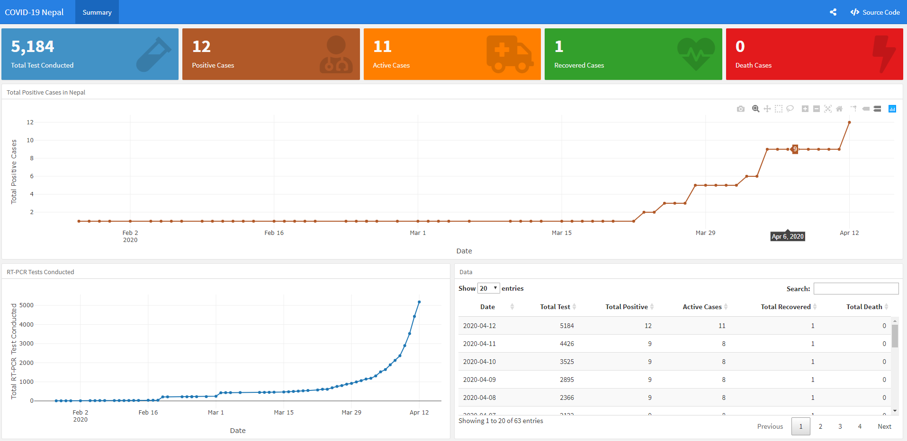

# covid19nepal

This is a dashboard created using [flexdashboard](https://rmarkdown.rstudio.com/flexdashboard/) R-package for COVID-19 Nepal data. The data is curated from data released (updated daily) from the Government of Nepal, Ministry of Health and Population, [Health Sector Response to Coronavirus Disease (COVID-19)](https://drive.google.com/drive/folders/1QhLMbT76t6Zu1sFy5qlB5aoDbHVAcnHx). 

