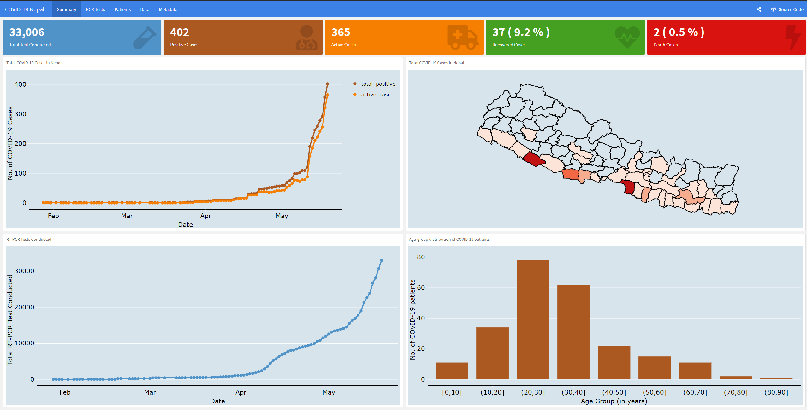

# covid19nepal

This is a dashboard created using [flexdashboard](https://rmarkdown.rstudio.com/flexdashboard/) R-package for COVID-19 Nepal data. The data is curated from data released (updated daily) from the Government of Nepal, Ministry of Health and Population, [Health Sector Response to Coronavirus Disease (COVID-19)](https://drive.google.com/drive/folders/1QhLMbT76t6Zu1sFy5qlB5aoDbHVAcnHx). 

  
[Disclaimer: The map of Nepal above may not reflect the updated boundaries as recently approved by the Government of Nepal in May 2020. The map will be updated after the Survey Dept. of Govt. of Nepal will release the updated administrative map of Nepal.]